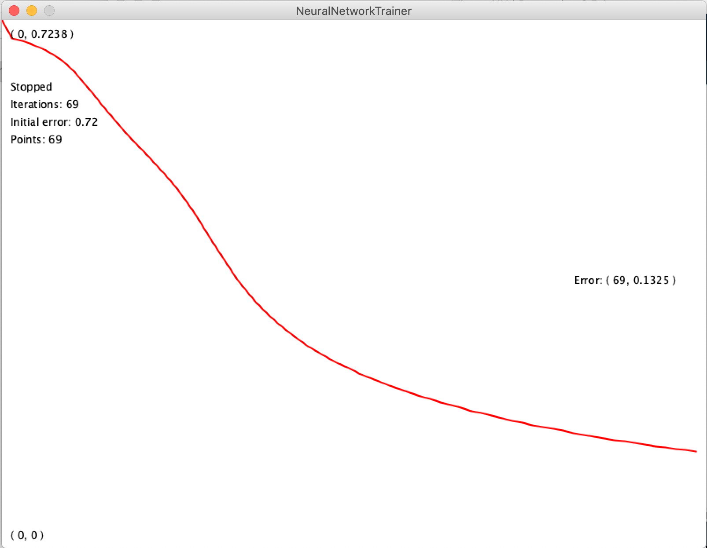

This is a self contained feedforward neural network trainer implemented in Processing. It does not require any third party libraries. 

If you need a trained neural network in any of your Processing projects all you need to do is:

1. Supply your training data. This could be done in multiple different ways (examples provided in ExampleDataSets.pde and Trainer.pde):
	2. supply them in a csv file (inputs in "i#" columns, targets in "t#" columns)
	3. create them parametrically in your code (see ExampleDataSets.pde and RuleTrainer in Trainer.pde)
4. Train your network to the desired error level.
5. Save it to a .json file
6. Copy saved file along with Matrix.pde and NeuralNetwork.pde to the Processing projects where you want to use it.

An example of this (using RuleTrainer) can be found [here](https://github.com/iiliev/processing_neural_network_race_car_example) 